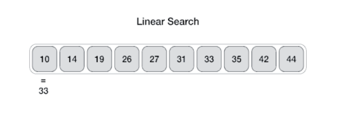

# Searching

## 1. Linear Search
## What is Linear or Sequential Search? 

*Linear search* or *sequential search* is a method for finding a target value within a list. 

It sequentially checks each element fo the list for the target value untill a match is found or untill all the elements have been searched.

Linear search runs in at worst linear time and makes at most n comparisons, where n is the length fo the list.

## How does Linear Seaerch work ? 
<br>



<br>

## *Algorithm*
<hr>

<b> Linear Search(array a, value val) </b>

step 1: set i to 1 <br>
step 2: if i > n then go to step 7 <br>
step 3: if a[i] = val then goto step 6 <br>
step 4: set i to i+1 <br>
step 5: goto step 2 <br>
step 6: return index i <br>
step 7: return -1 <br>
step 8: exit <br>
<hr>

### Full implementation

```java

public class LinearSearch {
    
    public static int linear_search(int [] arr, int key) {

        int size = arr.length;
        for(int i = 0; i < size; i++) {
            if(arr[i] == key) return i;
        }
        return -1;
    }
    
    public static void main(String[] args) {
        
        int [] inputArray = {24, 25, 65, 89, 90, 12, 1, 0, 30};
        int searchKey = 0;
        System.out.println("Key " + searchKey + " found at index: " + linear_search(inputArray, searchKey));
    }
}


```

## Performance of Linear Search
<hr>

Worst-case performance  $O(n)$ <hr>
Best-case performance $O(n)$ <hr>
Average-case performance $O(n)$ <hr>
Worst-case space complexity $O(1)$ <hr>

<hr> <hr>

## 2. Binary Search

## What is Binary Search ? 

Binary Search is a fastes search algorithm with run-time complexity of O(log n). This search algorithm works on the principle of divide and conquer.

For this algorithm to workd properly, the data collection should be in the sorted form. 

Binary Search compares the target value to the middle element of the array, if they are unequal, the half in which the target cannot lie is eliminated and the search continues on the remaining half until it is successfull or the remaining half is empty.

## How does it work? 
For Binary Search, it is mandatory for the target array to be sorted.

<hr>

<b>Pseudocode </b>

Procedure binary_search:

```
sorted array = a
size of the array = n
value to be searched = x
set lowerBound = 1
set upperBound = n

while lowerBound is less then or equal to upperBound:
    set midPoint = (lowerBound + higherBound) / 2; // array divided by two
    if a[midPoindnt] < x:
        set lowerBound = midPoint + 1
    else if a[midPoint] > x:
        set upperBound = midPoint -1
    else return location midPoint where x found
endwhile
    return -1 if x not found

```

# <b>Full Implementation<b>

```java

package searching;

public class BinarySearch {
    public static int binarySearch(int [] arr, int key) {

        int low = 0; 
        int high = arr.length-1;
        while(low <= high) {
            int mid = (low + high) / 2;
            if(key < arr[mid]) high = mid-1;
            else if(key > arr[mid]) low = mid+1;
            else return mid;
        }
        return -1;
    }

    public static void main(String[] args) {

        int [] inputArray = {3, 4, 5, 66, 78, 666, 5433, 9999, 10000};
        int key = 10000;
        int index = binarySearch(inputArray, key);
        if(index != -1) {
            System.out.println(key + " found at index " + index);
        } else {
            System.out.println(key + " not found!");
        }
    }
}


```


<hr>

## Performance of Binary Search

Worst-case performance --- $O(log n)$ <hr>
Best-case performance --- $O(1)$ <hr>
Average-case performance --- $O(log n)$ <hr>
Worst-case space complexity --- $O(1)$ <hr>

